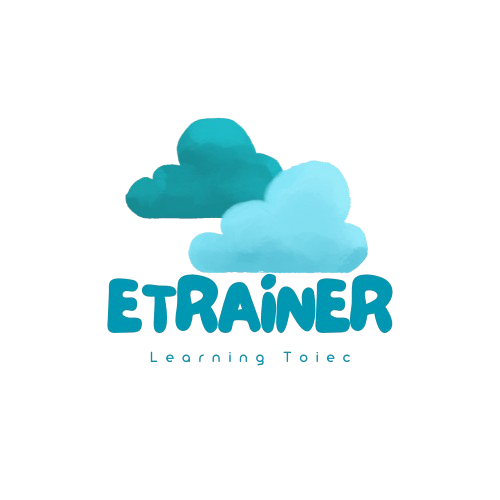

# eTrainer App



## Overview

eTrainer is a comprehensive mobile application designed to help users improve their language skills through interactive lessons, practice sessions, and personalized learning journeys. The app offers various features including grammar lessons, vocabulary practice, exam preparation, and AI-assisted learning.

## Features

- **Interactive Learning Journeys**: Personalized learning paths with daily lessons and progress tracking
- **Vocabulary Practice**: Flashcards, word lists, and interactive exercises
- **Grammar Lessons**: Comprehensive grammar explanations and exercises
- **Exam Preparation**: Practice tests and simulated exam environments
- **AI Chat Assistant**: Get help and practice with an AI language tutor
- **Progress Tracking**: Monitor your learning progress and achievements
- **Multilingual Support**: Available in English and Vietnamese

## Tech Stack

- **Framework**: React Native with Expo
- **Navigation**: Expo Router
- **State Management**: React Context API and React Query
- **Styling**: React Native StyleSheet
- **Localization**: i18next
- **Testing**: Jest and React Testing Library
- **API Communication**: Axios

## Installation

```bash
# Clone the repository
git clone https://github.com/quytttb/etrainer-app.git

# Navigate to the project directory
cd etrainer-app

# Install dependencies
npm install

# Start the development server
npm start
```

## Running the App

```bash
# Run on Android
npm run android

# Run on iOS
npm run ios

# Run on Web
npm run web
```

## Project Structure

```
etrainer-app/
├── app/                    # Main application screens and navigation
│   ├── (tabs)/             # Tab-based navigation screens
│   ├── auth/               # Authentication screens
│   ├── exam/               # Exam-related screens
│   ├── journeyNew/         # Learning journey feature
│   └── ...                 # Other app sections
├── assets/                 # Static assets (images, fonts)
├── components/             # Reusable UI components
├── constants/              # App constants and configuration
├── context/                # React Context providers
├── docs/                   # Documentation
├── hooks/                  # Custom React hooks
├── types/                  # TypeScript type definitions
└── utils/                  # Utility functions
```

## Documentation

For detailed documentation, please refer to the [docs](./docs) directory:

- [General Documentation](./docs/general/README.md)
- [Journey Module Documentation](./docs/journeyNew/README.md)
- [API Integration Guide](./docs/journeyNew/API_INTEGRATION_GUIDE.md)

## Contributing

1. Fork the repository
2. Create your feature branch (`git checkout -b feature/amazing-feature`)
3. Commit your changes (`git commit -m 'Add some amazing feature'`)
4. Push to the branch (`git push origin feature/amazing-feature`)
5. Open a Pull Request

## License

This project is licensed under the MIT License - see the LICENSE file for details.

## Contact

Project Link: [https://github.com/quytttb/etrainer-app](https://github.com/quytttb/etrainer-app) 